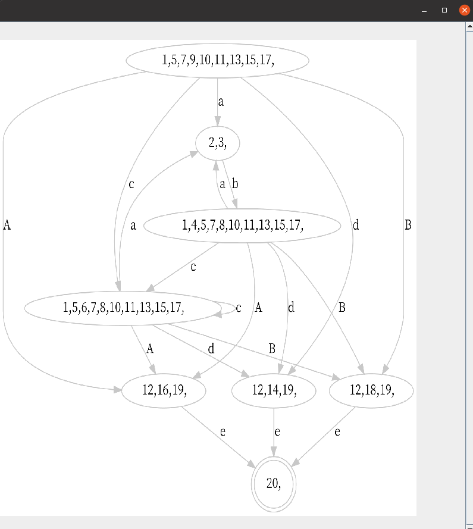

# compilers_principles_ex2

正则表达式支持运算符号有： 连接  选择 闭包  括号 ？  [ ]  +

扩展运算符需关注NFARegexUtil.createNFAGraph()、NFARegexUtil.calc()、NFARegexUtil.rank、NFARegexUtil.backSingleOps

build.gradle中添加了com.github.johnrengelman.shadow打包插件，依赖graphviz-java

代码注释详细

感谢[@huanxyx](https://github.com/huanxyx/DFAmin) [@wo883721](https://github.com/wo883721/SimpleRegex)

###实验要求

    实验二：XLEX生成器
    
    一、实验内容：
    设计一个应用软件，以实现将正则表达式-->NFA--->DFA-->DFA最小化-->词法分析程序
    
    二、必做实验要求：
    
    （1）正则表达式应该支持单个字符，运算符号有： 连接  选择 闭包  括号
    
    （2）要提供一个源程序编辑界面，让用户输入正则表达式
    
    （3）需要提供窗口以便用户可以查看转换得到的NFA
    
    （4）需要提供窗口以便用户可以查看转换得到的DFA
    
    （5）需要提供窗口以便用户可以查看转换得到的最小化DFA
    
    （6）需要提供窗口以便用户可以查看转换得到的词法分析程序
    
    （7）应该书写完善的软件文档
    
    三、选做实验要求：
      （1）扩充正则表达式的运算符号，如  ？  [ ]  + 等。
    

###运行截图

####示例：((ab)|c)*[dA-B]e

####示例对应nfa

####示例对应dfa

####示例对应最小化dfa

####示例对应C语言伪代码

